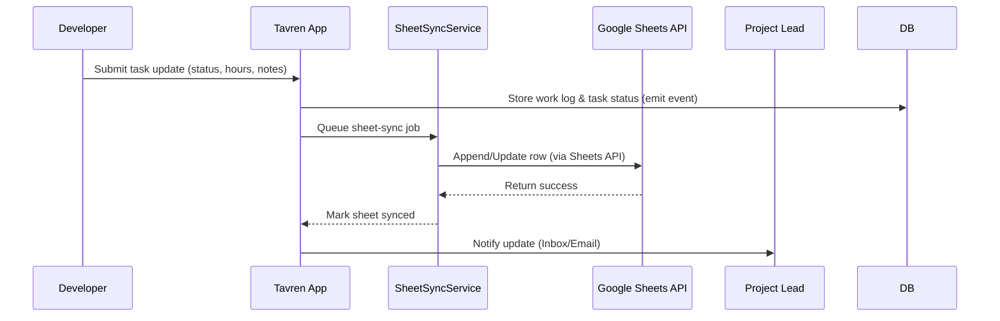
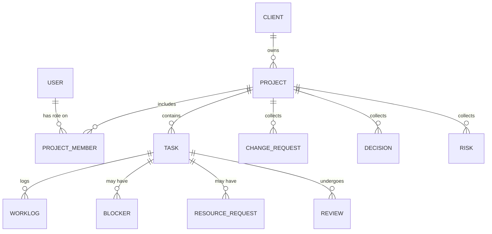
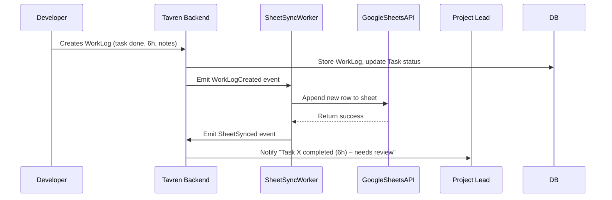

# Tavren Internal Operations OS

**Executive Summary:** Tavren’s Internal OS is a custom web platform to unify sales, project management, delivery, and reporting in one system. It replaces scattered Excel sheets, chat messages, and manual tracking with a centralized, automated workflow. The system tracks each project from lead through delivery, enforcing updates, managing resources, and generating client reports automatically. Strict role-based access controls (RBAC) and Postgres row-level security protect sensitive data, while an event-driven backend keeps Google Sheets in sync and notifies users of issues. The result is higher transparency, faster problem resolution, and better capacity planning for Tavren’s agency teams.

## Problem Statement

- **Fragmented Workflow:** Tavren’s current process spans Upwork, Discord/Slack, Google Docs/Sheets, Figma, email, etc. No single source of truth exists. This causes information loss, duplicated effort (e.g. updating multiple sheets), and ad-hoc communication.
- **Manual Tracking:** Project managers (Hammad, Hozefa) manually enter tasks, hours, and progress into Excel/Google Sheets. Developers must repeat status updates in chat. This is error-prone and time-consuming.
- **Lack of Visibility:** Team leads often don’t know if a developer is truly working, blocked, or waiting for input. Deadlines slip without warning.
- **Role Overlap and Confusion:** Salespeople (Muzammil, Saqlain, Shahab) hand off clients to ops, but details may not be fully captured. Developers are sometimes unaware of the bigger scope. Sensitive data (budget, client contact) is visible to people who shouldn’t see it.
- **No Enforced SLAs:** Follow-ups (on client dependencies, blockages) happen manually. Delays pile up unnoticed until a project is late.

**The solution** is a tailored internal operations web app where Tavren’s processes are codified. Core principles:
- *Data-Driven:* The database is the system of record (not spreadsheets).
- *Process Enforced:* Workflow rules and notifications drive behavior (e.g. require daily updates, escalate issues).
- *Role-Aware:* Everyone sees only what they should.
- *Automated Reporting:* When a developer logs work, client-facing sheets and dashboards update automatically (using Google Sheets API at no additional cost).

## Goals

- **End-to-End Visibility:** Seamlessly capture project status from lead to delivery and beyond.
- **Reduced Manual Work:** Minimize duplicate data entry (e.g. one update in the app updates client spreadsheets).
- **Faster Issue Resolution:** Enforce prompt updates and escalate missing information or delays.
- **Accurate Metrics:** Track actual vs. estimated hours, developer utilization, profitability, etc., from project data.
- **Security and Control:** Ensure sensitive fields are protected by RBAC and Row-Level Security.
- **Scalability:** Support any number of projects and users without licensing costs (using free tiers of Google Sheets and database hosting).
- **User-Friendly:** Work on any device, possibly as a PWA, so developers can quickly log updates even on the go.

## User Personas

- **Project Manager (PM):** (e.g. Hammad) Orchestrates client communication, assigns work, resolves blockers. Needs a high-level dashboard of all projects, incoming risks, and a personal “Needs Attention” inbox.
- **Delivery Lead:** (e.g. Hozefa for Shopify/WordPress) Manages project execution, assigns developers, reviews work, and ensures deadlines. Needs team workload view, per-project progress, and QA checklists.
- **Sales Manager/BD:** (e.g. Muzammil) Generates leads, closes deals, and ensures commitments are met. Sees opportunities pipeline and the health of projects tied to their sales.
- **Sales Rep:** (e.g. Saqlain, Shahab) Bids on jobs, communicates with clients, and handoffs projects when won. Tracks their own leads and closed projects’ statuses.
- **Developer:** (e.g. Ayan, Abdur Rehman) Works on assigned tasks. Should see only their tasks, requirements, and comments. Required to log progress and report blockers.
- **Collaborator:** (e.g. Ahmed as a temp QA or consultant) Could be an internal specialist or external contractor. Added per-project with limited access (e.g. can review tasks but not see budget).
- **Admin:** Manages system users, roles, project templates, integrations, and settings (e.g. adding a new Google API integration or defining approval workflows).

## End-to-End Project Lifecycle

1. **Lead Generation & Qualification**: Sales reps and BD create *Opportunities*. Each opportunity records client info, source (Upwork, inbound, referral), scope pitch, and estimated budget.
2. **Discovery & Handoff**: On closing a deal, the sales user fills a *Project Handoff Form* capturing promised scope, deadline, price, and files. Clicking **Convert to Project** creates a new project record with all details (client, scope, deadlines, assigned Sales Owner, etc.).
3. **Project Kickoff**: PM and Delivery Lead meet to confirm readiness. Checklist: project assets collected (Figma/design, content, access), team assigned, timeline set, and scope locked. Status changes from *Draft* to *Active*.
4. **Task Planning**: For each project, predefined templates generate tasks (e.g. “Homepage”, “PDP”, “Klaviyo Setup”). Leads assign tasks to developers or themselves, setting due dates and estimates.
5. **Development & Reporting**: Developers regularly log *Work Updates* (hours, description, status). The app enforces daily updates or marks tasks *Needs Update*. Blockers or resource requests (e.g. “need Shopify access”) generate notifications to leads.
6. **Milestones and QA**: As tasks complete, they go into *Review* status. Leads perform QA checklists (browser/viewport tests) and approve or request revisions. Milestones (e.g. “Design Complete”, “Client Review”) track high-level progress.
7. **Scope Changes**: If the client requests new work, a *Change Request* record is created, detailing additional scope and impact on deadline. PM reviews it, possibly adjusting budget/schedule.
8. **Client Review & Handoff**: Once internally complete, deliverables are shared with the client. Client feedback or approval is recorded. Final QA and sign-off mark the project *Completed*.
9. **Post-Mortem & Billing**: Project data (actual hours, finances) are archived. Lessons learned, or case-study notes can be added to a *Knowledge Base*. Profitability metrics are computed from recorded data (this remains hidden from developers).

Any delays or issues generate automatic alerts (e.g. “Project at Risk” if a deadline nears without sufficient progress). Managers view consolidated dashboards for all projects, while each team member sees only relevant tasks.

## Core Modules

### Home / Inbox  
- Personalized “Needs Attention” queue for each user (e.g. unresolved blockers, overdue approvals, pending reviews).  
- Daily/weekly summary notifications: “3 tasks overdue, 2 blockers pending.”  
- Company announcements or internal news feed.  

### Sales  
- Leads/Opportunities database with client/company records.  
- Pipeline stages (New, Qualified, Closed Won/Lost) and standard handoff forms.  
- Link from Opportunity to Project conversion.  
- Commission targets or deal tracking (for managers).  

### Clients  
- Directory of client companies and contacts (only visible to authorized roles).  
- History of projects with each client, contacts, and notes.  
- Shared assets (designs, contracts) and login credentials registry (with restricted view).  

### Projects  
- Central workspace per project with fields: Name, Client, Owners (Sales, PM, Delivery Lead), Timeline (internal vs client), Status (On Track, At Risk, Blocked, Completed), and key metrics (estimated vs logged hours).  
- Associated tasks, milestones, change requests, decisions, and logs.  
- File and link repository: designs (Figma), repos (GitHub), site (Shopify), documents, etc.  
- Client dependencies and outstanding items clearly listed.  

### Work / Tasks  
- Task list per project, each with description, assignee, due date, priority, estimated effort, and status (Not Started, In Progress, Blocked, Review, Done).  
- Developers can self-assign or request tasks.  
- Bulk import of tasks from templates or spreadsheets.  
- Drag-and-drop task ordering if desired.  

### QA & Reviews  
- When a developer marks a task *Done*, it moves to *Ready for Review*.  
- Leads see a *Review Queue* and can approve or send back for revision with comments.  
- Checklist templates (e.g. Shopify QA items) ensure nothing is overlooked.  
- Track number of revision rounds per task and final acceptance.  

### Team  
- Employee profiles: role, skills, rates (internal cost), current capacity, contact info.  
- Skill tags (Shopify, WordPress, React, GHL, etc.) and seniority.  
- Workload charts (allocated vs available hours) for leads.  
- History of performance metrics (on-time rate, report compliance).  
- Vacation/leave calendar.  

### Knowledge  
- Internal documentation: SOPs, style guides, onboarding manuals, technical tips.  
- Searchable KB for “How to request Shopify access” or coding best practices.  
- Meeting notes repository linked to projects.  

### Management  
- Dashboards aggregating high-level stats: project counts by status, overdue tasks, total logged hours, upcoming milestones.  
- Custom reports (time spent by client/team, revenue vs cost).  
- Audit log (see who changed what and when).  
- Settings for business rules (e.g. update deadlines, escalation thresholds).  

### Admin  
- User management, roles, and permissions configuration.  
- RBAC policies and RLS enforcement in database.  
- Google Sheets integrations and mapping templates.  
- Project templates (task sets) and change request workflows.  
- Notification channel settings (email, Slack/Discord webhook).  

## Feature Specifications

### Employee Profiles  
- Fields: Name, Email, Role, Skills, Seniority Level, Billable Rate, Team, Manager.  
- Display current projects/tasks and workload.  
- Performance stats (internal only): update compliance, avg. completion time.  
- Ability to mark “Out sick” or “Vacation” so assignments skip them.  

### Project Workspace  
Every project page contains:  
- **Summary:** Client, type (e.g. Shopify site), sales lead, PM, delivery lead, start/end dates, budget, internal cost. (Finance fields visible only to Admin/PM roles.)  
- **Scope & Requirements:** Captured from meetings or design docs.  
- **Tasks:** Interactive list with statuses and assignments.  
- **Milestones:** Predefined or custom checkpoints (Design Complete, Internal QA, Client Review, Launch).  
- **Files/Links:** Figma, repos, asset folders, credentials (with restricted view).  
- **Communications:** Project-specific discussion/comments.  
- **Change Requests:** List of out-of-scope requests with status (Pending, Approved, Rejected).  

### Task and Status Workflow  
- Tasks have statuses: **Todo → In Progress → (Blocked?) → Review/QA → Done**.  
- *Blocked* status triggers a blocker event.  
- Leads can assign tasks or developers can claim from unassigned backlog.  
- Drag-and-drop or priority flags reorder tasks.  
- Recurring tasks or daily checklists (e.g. “Daily standup note”) can be created.  

### Work Updates and Time Logging  
- Developers must log work against tasks. A single entry can mark a task complete if appropriate.  
- **Time Entry Form:** Task, status update (Done/Blocked/Progress), hours spent, description. E.g. “Hero section done, 6h – implemented desktop/mobile.”  
- On submission:  
  - The task’s status/time fields are updated in Tavren DB.  
  - An activity log entry is created.  
  - Notifications are triggered (e.g. PM sees task ready for review).  
  - Google Sheet sync job is queued (append or update row).  
- Entry imposes minimal burden: shorthand or voice-to-text acceptable, to encourage compliance.  

### Blockers and Help Requests  
- Developers click “Report Blocker” to signal: blocked category (e.g. “Missing access”, “Requirement unclear”), description, and optional urgency flag.  
- Blockers auto-assign to the relevant lead (Hozefa/Hammad) for resolution.  
- A separate “Help Request” option can signal a non-critical question (“Need senior help”).  
- Blockers escalate if not resolved (see **Escalation** below).  

### Resource/Access Requests  
- Similar to blockers but specifically for assets/credentials: e.g. “Request Shopify collaborator access”, “API key for Klaviyo”.  
- Requests log which resource is needed and who is responsible.  
- Leads track requested vs provided; this shows as “Waiting on Resources” in project.
  
### Sheet Mapping & Sync  
- **Purpose:** Automate updating client Google Sheets (or internal timesheets) from Tavren data, eliminating manual copy.  
- **Sheet Types:**  
  - *Append-mode sheet* (activity log): Each entry adds a new row (Date, Task, Dev, Hours, Notes).  
  - *Update-mode sheet* (structured template): Predefined tasks exist; updating an existing row (e.g. marking “Hero Section” done).  
- **Configuration:** Per-project mapping defines which columns correspond to Tavren fields: e.g. Task → “Task Name”, Hours → “Time Spent”, Description → “Notes”.  
- The admin or PM connects each project to a Google Sheet by URL/ID (sharing it with the app’s service account).  
- **Google Sheets API:** Use the official API with OAuth/Service Account credentials. Quotas are generous (300 reads/writes per minute per project). Standard usage is free; implement exponential backoff on 429 errors.  
- **Sync Workflow (Mermaid sequence):**  

- **Error Handling:** If a sync fails (network or API limit), jobs retry with exponential backoff. After 3 failures, flag as *Sync Error* for admin review, with retries logged.  

### Sheet Mapping UI  
- On project creation, prompt to attach a sheet. Read header row to guess column mappings. Admin can adjust or define mapping templates for common sheet formats.  
- Indicate per-column: “Task / Description / Developer / Hours / Date / Status” ←→ Tavren field.  
- Provide examples and one-click presets (e.g. “Standard Task Log”, “Client Timesheet”).  

### Time Entries and Work Log  
- All logged hours accumulate by project, task, and developer.  
- Developers can view personal time history (with only their entries).  
- Leads/Managers see team time summary.  
- Enables calculation of **utilization** and **budget tracking** (internal only).  

### Project Templates & Milestones  
- Define templates for common project types (e.g. “Shopify Store Build”, “GHL Setup”). Each template creates tasks and milestones automatically when a project is created.  
- Milestones have due dates relative to project start or client deadline.  
- Alerts if milestones slip (e.g. “Design approval was due yesterday”).  

### Reviews / QA Checklist  
- **QA Workflow:** Tasks must be *approved* to be marked *Done*. Leads click “Review” on tasks submitted. They can comment or mark as “Revision Needed”.  
- **Checklists:** Attach a checklist to tasks or projects (e.g. “Test on mobile/tablet, cross-browser”). The reviewer checks items off.  
- **Versioning:** Keep snapshots of completed deliverables or PR links.  

### Change Requests & Scope Management  
- Client asks beyond original scope logged as a *Change Request* record: description, requested by (client), date.  
- Impact estimation (in hours, cost, deadline) is added by PM/lead.  
- Status: “Pending Approval, Approved with Extra, Rejected”.  
- On approval, additional tasks/time are added to the project.  

### Decision Log  
- Any important internal decision (e.g. technology choice, deadline extension, vendor quote) is recorded as a decision note with date and author.  
- Linked to project and optionally to a task or requirement.  
- Ensures reasoning is documented.  

### Risk Register  
- Document potential project risks (e.g. “Client might not supply product data on time”, “Custom API untested”).  
- Each risk has severity (Low/Med/High) and mitigation plan.  
- Auto-alert if a risk status changes (e.g. “High risk realized: client failed to deliver images”).  

### Notifications & Escalation  
- **In-App Inbox:** Every user has an inbox of items needing attention (blockers, approvals, tasks).  
- **Notifications:** Configurable channels: email, Slack/Discord webhook, push notifications (if PWA).  
- **Escalation Rules:** Administratively defined SLAs (e.g. “Lead must respond to blocker within 8h”). A violation triggers reminders:  
  - 1st missed deadline → automated reminder to responsible person.  
  - 24h past due → alert their manager/PM.  
  - 48h → project status marked *At Risk*.  
- **Alert Types:** Task overdue, no update from dev, unresolved blocker, pending change request, nearing deadline with incomplete work.  

### “Needs Attention” Inbox  
- Consolidates actionable items per role:  
  - **Developers:** Outstanding tasks, missed daily reports, unresolved blockers.  
  - **Leads/PM:** Pending task reviews, developer blockers, client approvals needed, pending change requests.  
  - **Sales:** New tasks for closed clients, project status alerts to update clients.  
- This queue is the primary screen for users each day (much like email).

### Dashboards & Analytics  
- **Project Health Dashboard:** Lists projects with traffic-light indicators (On Track/At Risk/Blocked) based on deadlines and blockers.  
- **Workload Dashboard:** Shows each team member’s allocation vs. capacity for the week.  
- **Time Tracking Dashboard:** Cumulative hours per project/client, variance vs estimates.  
- **Profitability Dashboard (internal):** Revenue vs hours/cost per project (visible only to management).  
- **Reporting Compliance:** Chart of updates submitted vs expected per developer (enabling performance reviews).  

### Universal Search  
- Full-text search across all projects, tasks, comments, KB articles.  
- Example queries: “Client X Shopify issue” or “Klaviyo setup” should find relevant tasks, projects, and documentation.  

### Onboarding & Offboarding  
- **Onboarding Checklist:** For new users, define steps (account creation, training materials, initial project). The system tracks completion.  
- **Offboarding:** When removing a user, ensure their tasks are reassigned and their hours logged are retained. A report lists all assets/roles that depended on them.  

### Audit Log  
- Immutable log of key actions: user creation, role changes, project status changes, time edits, permission grants, etc.  
- Viewable by admins to trace changes and user activity.  

---

## Roles & Permissions (RBAC Model)

Tavren OS uses **role-based access** plus **row-level security** so users see only what they should. By default, all data is hidden until granted. There are two layers:

- **System Roles (Global):** Define high-level permissions (e.g. can manage users, can view financials). Examples: Admin, Project Manager, Delivery Lead, Sales Rep, Developer.  
- **Project Roles (Scoped):** Within each project, a member has a project role granting specific access (e.g. “Developer”, “QA Collaborator”, “Technical Lead”, “Sales Owner”). This fine-tunes what project data they see. For instance, Ahmed as a “QA Collaborator” might view tasks and leave comments but not see budget fields or add clients.

**Permissions Table (example):**

| Permission                | Admin | PM | Delivery Lead | Sales | Developer | Collaborator |
| ------------------------- |:-----:|:--:|:-------------:|:-----:|:---------:|:------------:|
| Create/Edit Projects      |  ✓    | ✓  | ✓             | ✓     |    ✗      |      ✗       |
| View All Projects         |  ✓    | ✓  | ✓ (own team)  | ✓     | ✓ (assigned) |   ✓ (collab) |
| Edit Project Scope/Budget |  ✓    | ✓  | ✗             | ✗     |    ✗      |      ✗       |
| Assign Tasks              |  ✓    | ✓  | ✓ (own)       | ✗     |    ✗      |      ✗       |
| Log Work (Time)           |  ✓    | ✗  | ✗             | ✗     |    ✓      |     ✗        |
| View Work Logs (Team)     |  ✓    | ✓  | ✓ (own team)  | ✗     |    ✗      |     ✗        |
| Report/Export Data        |  ✓    | ✓  | ✓             | ✓ (own) | ✗       |     ✗        |

*(Admin = Tavren administrator; PM = Project Manager/Hammad; Sales = Muzammil/Sales Reps; Collaborator = temporary project user)*  

**Field-Level Security:** Sensitive fields (client contact, contract value, internal notes) are separated in the database and only exposed via queries if the user has `financials.view` or `client.private.view` permissions. This is enforced by Postgres Row-Level Security policies. For example, even if a developer inspects the database, RLS ensures their queries cannot return hidden rows or columns.

**Project Collaborators:** Any user can be added to a project with a custom role. Hammad (PM) or Admin can invite, say, Ahmed as a “Technical Overseer” on Project X. In that project, Ahmed inherits only the permissions granted by that role (e.g. viewing all tasks and code, approving QA, but not seeing the budget or managing team members).

**Temporary Access:** Collaboration invitations can have expiration dates. For instance, a freelancer added for 5 days to resolve a bug. After expiry, their project access auto-revokes.

**Audit Trail:** Every permission change, role assignment, or data access is logged for accountability. This helps track “who saw or changed what”.

By combining global roles with project-scoped roles and database RLS, Tavren OS ensures a *deny-by-default* posture: no user can read or write data outside their assigned permissions.

## Reporting Enforcement & Escalation

To ensure projects advance smoothly, the system enforces **regular updates** from developers:

- **Daily Updates Required:** Each active task should have a status or work log entered at least once per business day.  
- **Automatic Reminders:** If a developer misses the daily update deadline, the task is flagged “⚠ Update Required.” The next login or reminder prompts them to fill in the log (e.g. “No update for Task A today. Submit work completed or mark waiting/blocked.”).  
- **Escalation Tiers:** Unresolved update misses escalate automatically:  
  1. *Missed Deadline:* System sends reminder to Developer.  
  2. *>1 Business Day:* Task status changes to **Stalled**; Lead (Hozefa) is notified.  
  3. *Repeated (e.g. 3 in 30 days):* Appears on PM’s “Compliance Report” and triggers a private flag for review.  
- **Lead/Manager Accountability:** Similarly, if a lead fails to respond to a blocker within the SLA, the issue is escalated to the PM (Hammad) or higher.

**Policy Dashboard:** A special view shows each developer’s “reporting compliance” (updates submitted vs. expected), along with summary metrics like on-time completion rate. Managers can use this in performance reviews.

*Note:* “Grace periods” (e.g. weekends, approved leave, client delays) can be configured so alerts aren’t raised during holidays or known exceptions.

## Data Model Overview

Key **entities** (tables) include:

| Entity              | Key Fields                                      | Description                              |
|---------------------|-------------------------------------------------|------------------------------------------|
| **User**            | id, name, email, global_role                    | System account (employee or collaborator). |
| **Project**         | id, client_id, name, status, sales_owner_id, pm_id, delivery_lead_id, start_date, end_date, ... | Project record.                     |
| **Client**          | id, name, contacts, industry                    | Client company data.                     |
| **ProjectMember**   | id, project_id, user_id, project_role, added_on  | Users’ roles on specific projects.       |
| **Task**            | id, project_id, title, description, assignee_id, status, estimated_hours, due_date | Work item within a project.       |
| **WorkLog**         | id, task_id, user_id, date, hours, notes         | Time entries / progress updates.        |
| **Blocker**         | id, task_id, reported_by, category, description, resolved, resolved_by | Issue blocking progress.         |
| **ResourceRequest** | id, task_id, requested_by, resource_type, details, fulfilled_by | Assets or access needed.     |
| **ChangeRequest**   | id, project_id, description, estimated_hours, status | Scope change proposals.       |
| **Review**          | id, task_id, reviewer_id, status, comments       | QA review records.                      |
| **Decision**        | id, project_id, content, decided_by, date       | Recorded decisions.                     |
| **Risk**            | id, project_id, description, severity, status    | Identified project risks.               |
| **Notification**    | id, user_id, related_entity, message, seen      | System alerts/messages.                 |
| **ProjectTemplate** | id, name, description                           | Predefined task sets.                   |
| **TaskTemplate**    | id, template_id, title, description, days_offset | Tasks in a template.                |
| **AuditLog**        | id, user_id, action_type, entity_type, timestamp, details | Admin audit records.     |
| ...                 |                                                 |                                          |

*(Each `o{` means “zero or more”)*

This diagram highlights relationships (e.g. a Project has many Tasks; each Task may have multiple WorkLogs or Blockers). Every database table with sensitive data will have RLS policies to restrict rows to authorized users.

## Architecture & Workflows

- **Web Frontend:** Single-page app (works on mobile/desktop). Acts as a PWA so users can quickly add updates on any device.
- **Backend API:** Event-driven. When a user action occurs (e.g. WorkLog created, Task updated), the service writes to the database and emits events.  
- **Event Queue / Workers:** A background worker (or serverless function) listens for events like *WorkLogCreated* or *TaskStatusChanged*. It handles side-effects: updating Google Sheets, sending notifications, updating dashboards.  
- **Google Sheets Sync:** As shown in the sequence diagram above, a dedicated sync service calls the Sheets API. It uses exponential backoff on errors and logs each sync job’s status.  
- **Notification System:** Events trigger notifications. E.g. *BlockerCreated* sends a message to the project lead’s inbox. *ProjectAtRisk* alerts PM and Delivery Lead.  
- **Data Security:** All API requests are authenticated. Even inside the backend, database queries apply Row-Level Security, ensuring users only access permitted rows. Sensitive fields (client emails, contract values) are returned only if the user’s role includes the `*_view_private` permission.

**Error Handling:** Sync jobs retry on transient errors. On persistent failure (e.g. Sheets API quota exceeded or network down), the job is flagged “failed” and an alert sent to Admin. Similarly, invalid user inputs (e.g. required fields missing) are caught server-side and shown in the UI.

### Event Flow Example

This decoupled design ensures the UI remains responsive (the developer can continue working while the sheet sync and notification happen in the background).

## Mobile / PWA Considerations

Tavren OS will be a **Progressive Web App** (PWA) to allow installation on phones and tablets without an app store. Key features:
- **Responsive UI:** Works on any screen size (phone, tablet, desktop).
- **Offline Mode:** Basic viewing and drafting (caching the latest project/tasks). On reconnect, auto-sync.
- **Installable:** Users can “Add to Home Screen” and get a native-like experience.
- **Push Notifications:** (Future) Use Web Push for critical alerts (e.g. blocker resolved).

Because PWAs are served over HTTPS and use service workers, they meet modern security standards and provide offline capability.

## Privacy & Security

- **Deny-By-Default:** No record is accessible unless specifically permitted by RBAC and RLS. This prevents leaks if a user finds a URL or guesses an ID. 
- **Row-Level Security (RLS):** For each table, policies enforce that users can only see rows they own or are part of. E.g. a developer sees only their WorkLogs and assigned Tasks; a PM sees all tasks in their projects. RLS is implemented via SQL policies (e.g. `auth.uid() = task.assignee_id OR project.pm_id = auth.uid()`).
- **Field Encryption:** Sensitive fields (e.g. stored tokens/credentials) are encrypted at rest.
- **Audit Logging:** All access to sensitive resources (like client records) is audited.  
- **Authentication:** Use secure auth (OAuth/JWT) with strong passwords or SSO. Sessions expire.  
- **Network Security:** Host only accessible over HTTPS. Use HTTP security headers (HSTS, CSP).
- **Compliance:** We store no PII beyond what clients submit. If needed, data policies (e.g. GDPR) should be documented later.

Because RLS enforcement happens in the database layer, even a malicious user cannot bypass it by directly querying the DB. This “defense in depth” ensures security.

## Testing and Rollout

**MVP Scope:** To start, build core modules that deliver maximum value:
- **People & Teams:** User accounts with roles, profiles.
- **Projects:** Creation, assignment, and basic status tracking.
- **Tasks & Work Logs:** Creating tasks, assigning developers, logging hours.
- **Blockers & Resource Requests:** Reporting and resolving blockers.
- **Review/QA:** Marking tasks as reviewed or needing fixes.
- **Dashboards/Reports:** Simple list views (task list, project list, my tasks).
- **Google Sheets Sync:** Basic append/update (with admin configured templates).
- **Notifications:** In-app notifications (email/Slack integration optional).
- **RBAC:** Enforce project-level access.

**Testing:** 
- *Unit Tests:* For core business logic (e.g. saving a WorkLog updates task status).
- *Integration Tests:* Simulate user flows (create project, add tasks, sync to sheet).
- *Security Tests:* Verify RLS policies prevent data leaks.
- *User Acceptance:* Pilot with Tavren staff, gather feedback.

**Data Migration:** 
- Import existing data (clients, projects, tasks) from Google Sheets/Excel via CSV. 
- Optionally, a Slack/Discord archive can be ingested for historical chat logs.
- Initially run Tavren OS *in parallel*: developers log work in the app while leads double-enter into old sheets. After confidence, switch primary to Tavren OS and retire old spreadsheets.
- Provide training sessions (docs/videos) for staff to adopt the new system.

**Rollout Plan:** 
1. Internal alpha with managers only, to build data model and templates.  
2. Beta with one team (e.g. Shopify) while still using old tools in parallel.  
3. Full production once workflows stabilize, with periodic feedback and iteration.

## Roadmap & Future Improvements

Tavren OS is meant to evolve. Possible future features (with placeholders):

| Quarter | Goals / Features                                   | Notes |
|---------|----------------------------------------------------|-------|
| Q4 2026 | **MVP:** Projects, Tasks, WorkLog, Blockers, Sheets Sync, Basic Dashboards | Internal pilot |
| Q1 2027 | **Add:** Change Requests, Decision Log, Risk Register, Milestones, Full RBAC | Board review and adjust SLAs |
| Q2 2027 | **Enhance:** Sales Pipeline module, Profitability analytics, Mobile app tweaks | Link with CRM / finance |
| Q3 2027 | **Integrations:** Slack/Discord for alerts, Calendar sync, Email notifications | Improve automation |
| Q4 2027 | **Scale:** Load testing, performance tuning, onboarding improvements, API access for plugins | Support more users/projects |

**Room for Improvement:** After MVP, we may add:
- AI-powered estimate vs actual forecasting (using collected time data).  
- Chatbot interface for quick updates.  
- More granular user roles or SSO integration.  
- Help center or guided tutorials inside the app.  
- Export/import tools (Jira integration, etc.).  
- Enhanced offline mode and push notifications (PWA feature).

*(This roadmap is illustrative. Exact timelines and scope are to be refined based on user feedback and resources.)*

---

**Sources & Standards:** This document is based on internal Tavren requirements and established best practices. It references Google Sheets API quotas and free usage, and Postgres RLS best practices. All features assume open-web standards and modern frameworks without vendor lock-in.